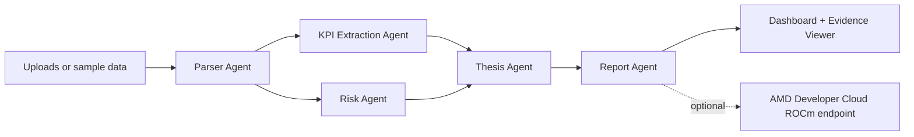

# EarningsPilot AMD

EarningsPilot AMD is a polished, end-to-end multi-agent earnings and filings intelligence system for the AMD Developer Hackathon. Investors, researchers, and operators can upload earnings transcripts, SEC filing excerpts, investor-presentation text, or KPI CSVs and receive a source-grounded analyst packet.


## Public demo URLs

- Hugging Face Space: <https://huggingface.co/spaces/Rohan556/earningspilot-amd>
- Vercel deployment: <https://earningspilot-amd.vercel.app>

## What the app generates

- Executive summary
- Company brief
- KPI extraction table
- Bull vs. bear case
- Management tone and risk analysis
- Forward-looking risk flags
- Concise action memo
- Evidence viewer with snippets and citations
- Agent trace showing the workflow

## Exact repo tree

```text
.
├── app/
│   ├── api/
│   │   ├── analyze/route.ts
│   │   └── sample/route.ts
│   ├── globals.css
│   ├── layout.tsx
│   └── page.tsx
├── components/
│   ├── Badge.tsx
│   └── Section.tsx
├── lib/
│   ├── agentPipeline.ts
│   ├── sample.ts
│   ├── text.ts
│   └── types.ts
├── eval/
│   └── golden-sample.json
├── sample-data/
│   ├── atlas-components-earnings-transcript.txt
│   ├── atlas-components-kpis.csv
│   └── atlas-components-risk-factors.txt
├── scripts/
│   ├── amd/serve-qwen-vllm-rocm.sh
│   ├── analyze-sample.mjs
│   ├── benchmark-amd-endpoint.mjs
│   └── evaluate-sample.mjs
├── training-data/
│   └── earningspilot-sft.jsonl
├── architecture.md
├── benchmark-notes.md
├── demo-script.md
├── Dockerfile
├── amd-40-gpu-hour-runbook.md
├── final-submission-checklist.md
├── finetuning.md
├── gpu-training-plan.md
├── next.config.mjs
├── package.json
├── postcss.config.mjs
├── slide-deck-outline.md
├── submission-description.md
├── tailwind.config.ts
└── tsconfig.json
```

## Architecture summary

EarningsPilot AMD uses a Next.js + TypeScript + Tailwind interface and a server-side agent pipeline in `lib/agentPipeline.ts`. The default public demo runs deterministic local analysis for reliability. Production mode can call an AMD Developer Cloud hosted OpenAI-compatible endpoint serving an open-source instruction model such as Qwen, Llama, DeepSeek, or Mistral.



## Local setup

```bash
npm install
cp .env.example .env.local
npm run dev
```

Open <http://localhost:3000> and click **Run instant sample demo**.


## 40 MI300X GPU-hour execution

With a 40 AMD Instinct MI300X GPU-hour budget, the goal is no longer just an optional model path. The GPU plan is to produce live proof: AMD-hosted Qwen inference, an EarningsPilot-Qwen-7B-LoRA adapter run, endpoint benchmarks, and eval artifacts. The operational runbook is `amd-40-gpu-hour-runbook.md`.

With your current directive, training is explicitly time-boxed to **15 MI300X GPU-hours**, with the remaining budget focused on endpoint reliability, benchmark capture, and demo-window inference uptime.

```bash
# On the AMD GPU host after installing a ROCm-compatible vLLM environment
AMD_MODEL_ID=Qwen/Qwen2.5-7B-Instruct ./scripts/amd/serve-qwen-vllm-rocm.sh

# From a machine that can reach the endpoint
AMD_OPENAI_BASE_URL=http://<gpu-host>:8000/v1 \
AMD_OPENAI_API_KEY=<temporary-key> \
AMD_MODEL_ID=Qwen/Qwen2.5-7B-Instruct \
npm run benchmark:amd
```

The app surfaces AMD run metadata in the analysis dashboard: GPU name, model ID, endpoint status, latency, and the 40 MI300X-hour budget.

To restart training with the expanded in-repo dataset on the AMD host, use the remaining budget as a hard timeout. The urgent 10-hour training dataset is committed at `training-data/earningspilot-sft-10h.jsonl` with 50,000 finance-agent SFT conversations (~52 MB). The smaller `training-data/earningspilot-sft-expanded.jsonl` remains available for 5,000-example smoke runs, and the 10-hour dataset can be regenerated with `npm run generate:sft:10h`.

```bash
# Stop idle inference first so the MI300X is used for training, not an unused server.
cd /root/EarningsPilot-AMD
git pull
TRAIN_HOURS=9 \
MAX_STEPS=100000000 \
BATCH_SIZE=4 \
GRAD_ACCUM=4 \
MAX_LENGTH=512 \
DATALOADER_NUM_WORKERS=2 \
ATTENTION_IMPL=sdpa \
CHECKPOINT_STEPS=1000 \
KEEP_CHECKPOINTS=8 \
MIN_TRAIN_ROWS=250000 \
RESUME_FROM_CHECKPOINT=auto \
TRAIN_FILE=training-data/earningspilot-sft-10h.jsonl \
BASE_MODEL=Qwen/Qwen2.5-7B-Instruct \
./scripts/amd/start-lora-training.sh
```

This writes adapter artifacts to `artifacts/lora/earningspilot-qwen-7b-lora-10h`, periodic checkpoints to `artifacts/lora/earningspilot-qwen-7b-lora-10h/checkpoint-*`, run status to `artifacts/lora/earningspilot-qwen-7b-lora-10h/training-run-status.json`, and append-only logs to `artifacts/logs/lora-train.log`. Re-running the same command resumes from the latest checkpoint by default because `RESUME_FROM_CHECKPOINT=auto`.

Check progress while training is running:

```bash
cd /root/EarningsPilot-AMD
OUTPUT_DIR=artifacts/lora/earningspilot-qwen-7b-lora-10h ./scripts/amd/training-progress.sh
```


If the host still appears to run an old smoke path, use the emergency forced launcher instead. It materializes a large JSONL file on disk before Trainer starts, refuses datasets under 100,000 rows, and writes separate logs so a 5-row smoke run cannot masquerade as the real run:

```bash
cd /root/EarningsPilot-AMD
git pull
TRAIN_HOURS=9 \
MAX_STEPS=100000000 \
MIN_TRAIN_ROWS=1000000 \
BATCH_SIZE=4 \
GRAD_ACCUM=4 \
MAX_LENGTH=512 \
DATALOADER_NUM_WORKERS=2 \
ATTENTION_IMPL=sdpa \
CHECKPOINT_STEPS=1000 \
KEEP_CHECKPOINTS=8 \
RESUME_FROM_CHECKPOINT=auto \
TRAIN_FILE=training-data/earningspilot-sft-10h.jsonl \
OUTPUT_DIR=artifacts/lora/earningspilot-qwen-7b-lora-10h-forced \
BASE_MODEL=Qwen/Qwen2.5-7B-Instruct \
./scripts/amd/start-forced-10h-training.sh
```


Check MI300X utilization while training is running:

```bash
cd /root/EarningsPilot-AMD
SAMPLES=10 INTERVAL=2 ./scripts/amd/gpu-utilization.sh
```

On the DigitalOcean vLLM one-click image, `rocm-smi` may only be available inside the `rocm` container; the helper automatically falls back to `docker exec rocm rocm-smi` when needed.

The optimized training defaults are tuned for the remaining 9-hour GPU window: pre-tokenized repeated samples to remove dataloader starvation, `MAX_LENGTH=512` to reduce attention cost, `BATCH_SIZE=4` with `GRAD_ACCUM=4` to improve GPU occupancy, SDPA attention when available, and less frequent checkpointing (`CHECKPOINT_STEPS=1000`) so training spends more time computing and less time saving.

The latest recorded AMD-hosted benchmark (May 7, 2026) reported `avgLatencyMs=391` over 3 runs with `avgOutputCharsPerSecond=789` on `Qwen/Qwen2.5-7B-Instruct` using AMD Instinct MI300X. The corresponding sample eval passed in `amd-openai-compatible` mode with 8 KPIs, 5 risks, and 32 evidence items.


To benchmark the trained adapter, start a vLLM OpenAI-compatible server after training:

```bash
cd /root/EarningsPilot-AMD
AMD_OPENAI_API_KEY=epamd-temp-key \
BASE_MODEL=Qwen/Qwen2.5-7B-Instruct \
ADAPTER_PATH=artifacts/lora/earningspilot-qwen-7b-lora-10h-forced \
SERVED_MODEL_NAME=EarningsPilot-Qwen-7B-LoRA \
./scripts/amd/serve-trained-adapter-vllm-rocm.sh
```

On the DigitalOcean vLLM one-click image, run the command inside the existing `rocm` container with `docker exec -it rocm /bin/bash`. Do not pass `python -m vllm...` as arguments to the Docker image entrypoint; the helper now auto-selects the modern `vllm serve <model>` launcher when the `vllm` CLI is available, and only falls back to the Python module for older local installs.


If the vLLM container reports an "unrecognized arguments" error mentioning `python -m` or `vllm.entrypoints`, you are probably passing commands to the Docker entrypoint instead of running inside the container shell. Use:

```bash
docker exec -it rocm /bin/bash
cd /root/EarningsPilot-AMD
VLLM_SERVER_CMD=vllm-serve \
AMD_OPENAI_API_KEY=epamd-temp-key \
BASE_MODEL=Qwen/Qwen2.5-7B-Instruct \
ADAPTER_PATH=artifacts/lora/earningspilot-qwen-7b-lora-10h-forced \
SERVED_MODEL_NAME=EarningsPilot-Qwen-7B-LoRA \
./scripts/amd/serve-trained-adapter-vllm-rocm.sh
```


If the existing one-click `rocm` container keeps rejecting manual commands through its entrypoint, bypass that entrypoint completely by starting a fresh vLLM ROCm container from the repo root:

```bash
cd /root/EarningsPilot-AMD
AMD_OPENAI_API_KEY=epamd-temp-key BASE_MODEL=Qwen/Qwen2.5-7B-Instruct ADAPTER_PATH=artifacts/lora/earningspilot-qwen-7b-lora-10h-forced SERVED_MODEL_NAME=EarningsPilot-Qwen-7B-LoRA ./scripts/amd/run-vllm-rocm-container.sh
```

This helper uses `docker run --entrypoint /bin/bash ...` and an inner shell script so Docker cannot collapse the vLLM command into a single malformed positional argument.


If vLLM remains unstable, use the vLLM-free Transformers fallback server. It is slower than vLLM, but it exposes the same OpenAI-compatible `/v1/chat/completions` API and is sufficient for the final AMD inference proof. The helper now creates/uses `.venv` with system site packages by default, which avoids Debian/Ubuntu `externally-managed-environment` pip failures while still seeing ROCm Torch from the host. Wait for `/health` to return `ok` before benchmarking, and keep fallback benchmark generations short (`BENCHMARK_MAX_TOKENS=96` by default, or `48` if the first run is close to the timeout). For emergency JSON benchmark capture when generation is too slow, leave `FALLBACK_RESPONSE_MODE=auto` so JSON-object requests use the fast grounded template path; set `FALLBACK_RESPONSE_MODE=generate` to force real Transformers generation:

```bash
cd /root/EarningsPilot-AMD
AMD_OPENAI_API_KEY=epamd-temp-key BASE_MODEL=Qwen/Qwen2.5-7B-Instruct ADAPTER_PATH=artifacts/lora/earningspilot-qwen-7b-lora-10h-forced SERVED_MODEL_NAME=EarningsPilot-Qwen-7B-LoRA HOST=0.0.0.0 PORT=8000 ./scripts/amd/serve-transformers-openai-rocm.sh

# In another shell, after the model finishes loading:
curl http://127.0.0.1:8000/health
AMD_OPENAI_BASE_URL=http://127.0.0.1:8000/v1 AMD_OPENAI_API_KEY=epamd-temp-key AMD_MODEL_ID=EarningsPilot-Qwen-7B-LoRA BENCHMARK_MAX_TOKENS=96 npm run benchmark:amd
```

After stopping training, collect evaluation and submission artifacts with:

```bash
cd /root/EarningsPilot-AMD
EARNINGSPILOT_BASE_URL=https://earningspilot-amd.vercel.app \
AMD_OPENAI_BASE_URL=http://127.0.0.1:8000/v1 \
AMD_OPENAI_API_KEY=epamd-temp-key \
AMD_MODEL_ID=Qwen/Qwen2.5-7B-Instruct \
OUTPUT_DIR=artifacts/lora/earningspilot-qwen-7b-lora-10h-forced \
LOG_FILE=artifacts/logs/lora-train-forced-10h.log \
./scripts/amd/post-training-eval.sh
```

This writes a timestamped `artifacts/eval/...` folder with checkpoint counts, trainer state, app eval output, AMD benchmark output, GPU utilization samples, and an adapter/log archive.

## GPU and custom-model plan

The original product intent is fulfilled through an AMD GPU-backed, open-source, domain-adapted model path rather than a from-scratch foundation model. For the hackathon, the recommended custom model is **EarningsPilot-Qwen-7B-LoRA**: a Qwen/Llama/Mistral/DeepSeek-family base model plus an EarningsPilot finance-agent LoRA adapter served on AMD Developer Cloud. See `gpu-training-plan.md` for GPU sizing and `finetuning.md` for the training recipe.

Recommended hardware:

- CPU only for the public deterministic demo.
- 1x AMD Instinct MI300X for 7B inference and LoRA/QLoRA adapter tuning.
- 1x MI300X, possibly quantized, for 14B-32B inference experiments.
- 8x MI300X only for 70B-class throughput or full fine-tuning experiments; not required for the hackathon demo.

## Training and evaluation path

The live demo does not depend on a freshly fine-tuned model because reliability matters for judges. Instead, EarningsPilot AMD ships a production-style model-improvement loop:

- `training-data/earningspilot-sft.jsonl` contains seed supervised fine-tuning examples for KPI extraction, risk classification, thesis generation, tone assessment, and report writing.
- `eval/golden-sample.json` defines golden expectations for the seeded demo package.
- `scripts/evaluate-sample.mjs` runs an end-to-end regression check against a local or deployed app.
- `finetuning.md` documents the AMD Developer Cloud LoRA/QLoRA path for Qwen, Llama, DeepSeek, or Mistral-family models.

```bash
# with the app running locally on port 3000
npm run eval:sample

# or against the production deployment
EARNINGSPILOT_BASE_URL=https://earningspilot-amd.vercel.app npm run eval:sample
```

## Optional AMD Developer Cloud model mode

Set these variables in `.env.local` or your deployment platform:

```bash
AMD_OPENAI_BASE_URL=https://your-amd-inference-host.example.com/v1
AMD_OPENAI_API_KEY=...
AMD_MODEL_ID=Qwen/Qwen2.5-7B-Instruct
```

The app expects a standard `/chat/completions` endpoint. This makes the model-serving layer portable across vLLM, TGI-compatible gateways, LiteLLM, or another ROCm-compatible serving stack on AMD cloud GPUs.

## Hugging Face Space deployment

Create a Docker Space and point it at this repo. The included `Dockerfile` runs the Next.js standalone server on port `7860`, which is the Hugging Face Spaces default.

Recommended Space settings:

- SDK: Docker
- Hardware: CPU Basic for deterministic demo, AMD GPU if available for model-serving experiments
- Secrets: `AMD_OPENAI_BASE_URL`, `AMD_OPENAI_API_KEY`, `AMD_MODEL_ID` only if using the AMD-hosted model path

## Vercel deployment

```bash
npm install -g vercel
vercel --prod
```

Set the same optional AMD environment variables in Vercel Project Settings if you want model-backed summaries.

## Why this scores well

- **Application of Technology:** Real multi-agent orchestration, structured outputs, evidence grounding, and optional AMD GPU-backed open-source inference.
- **Presentation:** One-click sample demo, clean dashboard, evidence viewer, and clear agent trace.
- **Business Value:** Speeds up earnings and filings triage for investors, IR teams, corporate strategy, and research analysts.
- **Originality:** It is not a generic chatbot; it produces a cited investment memo, KPI table, risk register, and bull/bear thesis packet.
