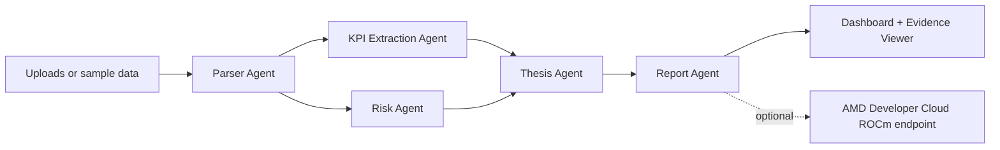

# EarningsPilot AMD

EarningsPilot AMD is a polished, end-to-end multi-agent earnings and filings intelligence system for the AMD Developer Hackathon. Investors, researchers, and operators can upload earnings transcripts, SEC filing excerpts, investor-presentation text, or KPI CSVs and receive a source-grounded analyst packet.


## Public demo URLs

- Hugging Face Space: <https://huggingface.co/spaces/Rohan556/earningspilot-amd>
- Vercel deployment: <https://earningspilot-amd.vercel.app>

## What the app generates

- Executive summary
- Company brief
- KPI extraction table
- Bull vs. bear case
- Management tone and risk analysis
- Forward-looking risk flags
- Concise action memo
- Evidence viewer with snippets and citations
- Agent trace showing the workflow

## Exact repo tree

```text
.
├── app/
│   ├── api/
│   │   ├── analyze/route.ts
│   │   └── sample/route.ts
│   ├── globals.css
│   ├── layout.tsx
│   └── page.tsx
├── components/
│   ├── Badge.tsx
│   └── Section.tsx
├── lib/
│   ├── agentPipeline.ts
│   ├── sample.ts
│   ├── text.ts
│   └── types.ts
├── eval/
│   └── golden-sample.json
├── sample-data/
│   ├── atlas-components-earnings-transcript.txt
│   ├── atlas-components-kpis.csv
│   └── atlas-components-risk-factors.txt
├── scripts/
│   ├── analyze-sample.mjs
│   └── evaluate-sample.mjs
├── training-data/
│   └── earningspilot-sft.jsonl
├── architecture.md
├── benchmark-notes.md
├── demo-script.md
├── Dockerfile
├── final-submission-checklist.md
├── finetuning.md
├── gpu-training-plan.md
├── next.config.mjs
├── package.json
├── postcss.config.mjs
├── slide-deck-outline.md
├── submission-description.md
├── tailwind.config.ts
└── tsconfig.json
```

## Architecture summary

EarningsPilot AMD uses a Next.js + TypeScript + Tailwind interface and a server-side agent pipeline in `lib/agentPipeline.ts`. The default public demo runs deterministic local analysis for reliability. Production mode can call an AMD Developer Cloud hosted OpenAI-compatible endpoint serving an open-source instruction model such as Qwen, Llama, DeepSeek, or Mistral.



## Local setup

```bash
npm install
cp .env.example .env.local
npm run dev
```

Open <http://localhost:3000> and click **Run instant sample demo**.


## GPU and custom-model plan

The original product intent is fulfilled through an AMD GPU-backed, open-source, domain-adapted model path rather than a from-scratch foundation model. For the hackathon, the recommended custom model is **EarningsPilot-Qwen-7B-LoRA**: a Qwen/Llama/Mistral/DeepSeek-family base model plus an EarningsPilot finance-agent LoRA adapter served on AMD Developer Cloud. See `gpu-training-plan.md` for GPU sizing and `finetuning.md` for the training recipe.

Recommended hardware:

- CPU only for the public deterministic demo.
- 1x AMD Instinct MI300X for 7B inference and LoRA/QLoRA adapter tuning.
- 1x MI300X, possibly quantized, for 14B-32B inference experiments.
- 8x MI300X only for 70B-class throughput or full fine-tuning experiments; not required for the hackathon demo.

## Training and evaluation path

The live demo does not depend on a freshly fine-tuned model because reliability matters for judges. Instead, EarningsPilot AMD ships a production-style model-improvement loop:

- `training-data/earningspilot-sft.jsonl` contains seed supervised fine-tuning examples for KPI extraction, risk classification, thesis generation, tone assessment, and report writing.
- `eval/golden-sample.json` defines golden expectations for the seeded demo package.
- `scripts/evaluate-sample.mjs` runs an end-to-end regression check against a local or deployed app.
- `finetuning.md` documents the AMD Developer Cloud LoRA/QLoRA path for Qwen, Llama, DeepSeek, or Mistral-family models.

```bash
# with the app running locally on port 3000
npm run eval:sample

# or against the production deployment
EARNINGSPILOT_BASE_URL=https://earningspilot-amd.vercel.app npm run eval:sample
```

## Optional AMD Developer Cloud model mode

Set these variables in `.env.local` or your deployment platform:

```bash
AMD_OPENAI_BASE_URL=https://your-amd-inference-host.example.com/v1
AMD_OPENAI_API_KEY=...
AMD_MODEL_ID=Qwen/Qwen2.5-7B-Instruct
```

The app expects a standard `/chat/completions` endpoint. This makes the model-serving layer portable across vLLM, TGI-compatible gateways, LiteLLM, or another ROCm-compatible serving stack on AMD cloud GPUs.

## Hugging Face Space deployment

Create a Docker Space and point it at this repo. The included `Dockerfile` runs the Next.js standalone server on port `7860`, which is the Hugging Face Spaces default.

Recommended Space settings:

- SDK: Docker
- Hardware: CPU Basic for deterministic demo, AMD GPU if available for model-serving experiments
- Secrets: `AMD_OPENAI_BASE_URL`, `AMD_OPENAI_API_KEY`, `AMD_MODEL_ID` only if using the AMD-hosted model path

## Vercel deployment

```bash
npm install -g vercel
vercel --prod
```

Set the same optional AMD environment variables in Vercel Project Settings if you want model-backed summaries.

## Why this scores well

- **Application of Technology:** Real multi-agent orchestration, structured outputs, evidence grounding, and optional AMD GPU-backed open-source inference.
- **Presentation:** One-click sample demo, clean dashboard, evidence viewer, and clear agent trace.
- **Business Value:** Speeds up earnings and filings triage for investors, IR teams, corporate strategy, and research analysts.
- **Originality:** It is not a generic chatbot; it produces a cited investment memo, KPI table, risk register, and bull/bear thesis packet.
